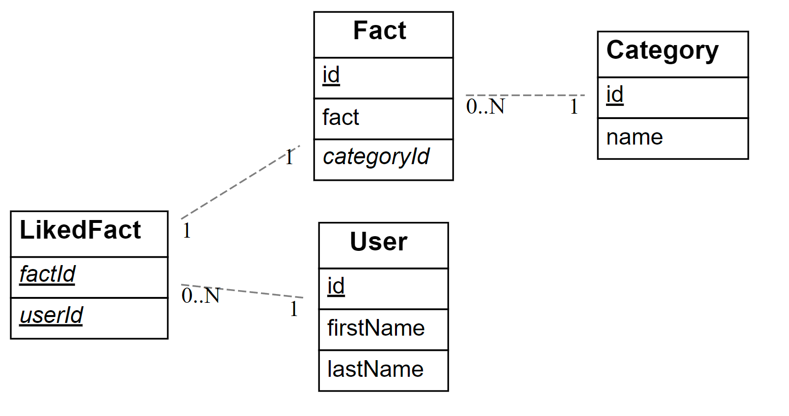
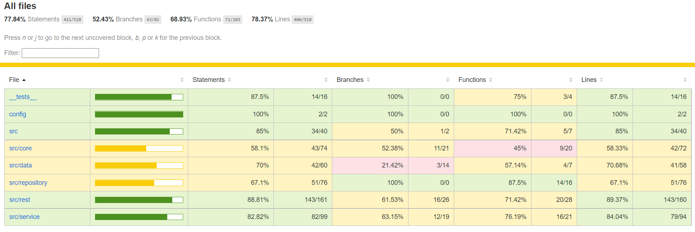

# Dries Uytterschaut (182254du)

> Duid aan welke vakken je volgt en vermeld voor deze vakken de link naar jouw GitHub repository. In het geval je slechts één vak volgt, verwijder alle inhoud omtrent het andere vak.

- [ ] Front-end Web Development
  - [GitHub repository](github.com/HOGENT-Web)
  - [Online versie](github.com/HOGENT-Web)
- [x] Web Services: GITHUB URL
  - [GitHub repository](https://github.com/Web-IV/2223-webservices-DriesU/tree/master)
  - [Online versie](https://github.com/DriesU/webservices_fact)

**Logingegevens**

- Gebruikersnaam/e-mailadres: dries uytterschaut
- Wachtwoord:test123!

## Projectbeschrijving

> Omschrijf hier duidelijk waarover jouw project gaat. Voeg een domeinmodel (of EERD) toe om jouw entiteiten te verduidelijken.
Bij dit project is het de bedoeling dat gebruikers facts kunnen bekijken, het is ook mogelijk om facts te bekijken met de category erbij. Als ze een fact tof vinden kunnen ze dat aanduiden en komt het bij hun persoonlijke lijst met gelikede facts. Deze lijst kunnen ze ook afzonderlijk bekijken.
moderators kunnen facts toevoegen terwijl gebruikers enkel de facts kunnen lezen en liken.

## Screenshots

## Behaalde minimumvereisten

### Web Services

- **datalaag**

  - [x] voldoende complex (meer dan één tabel)
  - [x] één module beheert de connectie + connectie wordt gesloten bij sluiten server
  - [x] heeft migraties
  - [x] heeft seeds
 

- **repositorylaag**

  - [x] definieert één repository per entiteit (niet voor tussentabellen) - indien van toepassing
  - [ ] mapt OO-rijke data naar relationele tabellen en vice versa
 

- **servicelaag met een zekere complexiteit**

  - [x] bevat alle domeinlogica
  - [x] bevat geen SQL-queries of databank-gerelateerde code
 

- **REST-laag**

  - [x] meerdere routes met invoervalidatie
  - [x] degelijke foutboodschappen
  - [x] volgt de conventies van een RESTful API
  - [x] bevat geen domeinlogica
  - [x] degelijke authorisatie op alle routes 
  - [ ] degelijke authenticatie op alle routes
 

- **varia**
  - [x] een aantal niet-triviale testen (min. 1 controller >=80% coverage)
  - [ ] minstens één extra technologie
  - [x] duidelijke en volledige `README.md`
  - [ ] maakt gebruik van de laatste ES6-features (object destructuring, spread operator...)
  - [x] volledig en tijdig ingediend dossier

## Projectstructuur

### Web Services

alles van repo/rest/service verdeelt in mappen onder src
apparte core en data(seeds en migrations) map
test directory heeft dezelfde structuur als de src map
config files in apparte config dir
## Extra technologie
niet van toepassing
### Web Services
niet van toepassing

## Testresultaten

### Web Services
fact.spec.js (get/post/put/del) getest
likedFact.spec.js (get/del) getest
user.spec.js (get/post/del) getest

## Gekende bugs
### Web Services
Geen tegengekomen.
